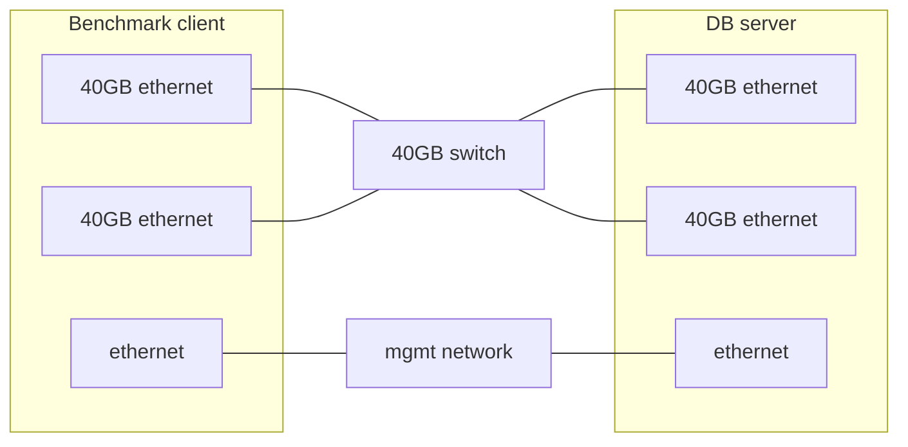
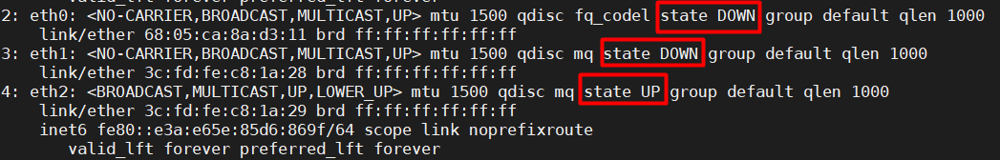
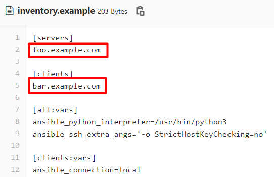

[//]: # (SPDX-License-Identifier: BSD-3-Clause)
[//]: # (Copyright 2021, Intel Corporation)

# Redis on KVM testcase

In this readme, you will find out how to run a memtier benchmark on a cluster of KVM-hosted Redis servers. 

## The test environment details

* Dedicated LAN or back-to-back (b2b) connection is used for benchmark traffic
* MacVTap interface is used to avoid the performance penalty of linux bridge 
* Client and server machines are coupled using their NUMA-respective NICs (memtier_benchmark in a docker container resides in the client machine whereas VMs with Redis database instance reside in the server machine) 
* VM's are created from pre-existing qcow2 images and use cloud-init configdrives for a basic set-up
* Most of the software runs in docker containers, the OS is Linux
* Consul is a DNS-based service discovery. (www.consul.io)
  * If you want to check if the Redis service is up and running, you can use Consul that runs on each virtual machine. Consul originates from the server machine and runs as an agent on each VM.
  *  We use Consul to discover IPs’ of Redis services in the stages of populating Redis databases and running the benchmark. 
* You can optionally export benchmark results to an S3 bucket

## Prework

You will need two machines: a client and a server. Once you physically set up your machines, you will have to configure them in order to run the memtier benchmark. 



Before you start working with the repository, make sure you have installed: 

* `Docker` on your client and server machines 
* `Ansible 2.7` 
* A python module – `netaddr` on your client machine. You can install it with your package manager or using pip. 

Get ip addresses of your 40GB NICs installed in **DB server** machine. You can do it using `ip address`. Ensure selected interfaces are in UP state and don't have any IPv4 address assigned



## How to run

When you have completed all the prerequisite steps, it is time to run the benchmark. You will do it by following the steps below:  

1. Clone the __benchmarking__  repo to your local machine

2. Change the directory to benchmarking by running the command __cd benchmarking__

3. Create an __inventory__ file, copy the content of _inventory.example_, and replace the example hostnames with your own client and server hostnames or IPs



4. Generate ssh keys on both client and server hosts. Then copy keys between them to enable a password-less connection.

5.	Run the ansible playbook to automatically set up the OS environment:

   ```
   ansible-playbook -i inventory ansible-playbook/setup.yml
   ```

6. Create VMs on the server machine by one of the two ways:

   * set up the required variables in the command below

     ```
     vm_memory_gib=<VM size in GiB> vms_number=<number of VMs> test_ifname=<ifname0,ifname1> ansible-playbook -i inventory ansible-playbook/create.yml
     ```
   * or modify `ansible-playbook/vars.yml` – you can specify the default values for the following variables in the __vars.yml__ file:

     *   _vms_number_default_
     *   _test_hw_class_default_
     *   _test_network_default_ 

   When you defined the variables, you can run the following shortened command: 
   ```
   vm_memory_gib=<VM size in GiB>  test_ifname=<ifname0,ifname1>  ansible-playbook -i inventory ansible-playbook/create.yml 
   ```
   Make sure your network set-up is correctly configured. When you use a shared LAN connection, double check there is no MAC/IP address conflict with other LAN users

   You can check your VMs IP addresses by running
   ```
   virsh net-dhcp-leases kvm-redis-nat
   ```

   You can also check the address pool of a Redis instance by running
   ```
   curl -s http://<server_ip>:8500/v1/catalog/service/redis |jq -r '.[]|.Address'
   ```
   or
   ```
   docker run consul consul catalog nodes -service=redis -http-addr=http://<server_ip>:8500
   ```
   You can also use consul GUI http://**<server_ip>**:8500/ui/ to get all addresses of Redis instances
   

    The image below is a pictorial representation of `create playbook`'s  each step 
   ```mermaid
   sequenceDiagram
     participant C as Client
     participant S as Server
     participant V as VMs
     Note over C: Generate<br/>unique run ID
     Note over C,S: Load playbook variables
     Note over S: Create macvtap <br/>interface(s) dhcpX
     Note over S: Run dhcp <br/>server(s) in docker
     Note over S: Initialize <br/>libvrit network
     Note over S: Run consul and <br/>docker-registry <br/>servers in docker
     S->>V: Create VMs
     Note over C: Add VMs to <br/>ansible inventory
     S-->>V: SSH ping
     V-->>S: SSH pong
     Note over C: Detect server NICs,<br/>set up client NICs
     Note over V: Load playbook <br/>variables
     C-->>V: SSH ping
     V-->>C: SSH pong
     Note over V: Run redis server<br/>and consul-agent<br/> in docker
     C-->>V: Redis ping
     V-->>C: Redis pong
     Note over C: Check if all VM's<br/>registered in consul
     Note over C: Delete client NICs
   ```

7. Once you created the VMs, you should populate Redis databases. You can do it by running the command: 
   ```
   vm_memory_gib=<VM size in GiB> ansible-playbook -i inventory ansible-playbook/populate-dbs.yml 
   ```

   Remember to provide _vm_memory_gib_ in the command

8. When you populated your databases, you can move on to launching the benchmark:  
   ```
   test_tag=<e.g. dram> ansible-playbook -i inventory ansible-playbook/run-benchmark.yml
   ```
  The test_tag variable can take one of the two parameters: `dram` or `any other, which you name yourself` e.g. pmem. When you run the command with the parameter you named youself, the additional information will be collected. The playbook will collect the following information: `ipmctl show -topology`, `ndctl list`, `daxctl list`.   
  
   You can also export the results of the benchmark to an S3 bucket   
   ```
   AWS_ACCESS_KEY=<s3_access_key> AWS_SECRET_KEY=<s3_secret_key> S3_BUCKET=<s3_bucket> S3_ENDPOINT=<s3_endpoint> test_tag=<e.g. dram> ansible-playbook -i inventory ansible-playbook/run-benchmark.yml --extra-vars "@ansible-playbook/s3_vars.yml"
   ```

   If you want to run the benchmark with a new configuration (e.g. you want to change a number of VMs and their size), you must recreate the environment for each run by cleaning it up. Otherwise, you can rerun the same benchmark as many times as you want in the previously created environment.

   By default 3 full-test iterations will be performed (run_count_default: 3) 


9. Once you ran the benchmark, you can clean up the environment (remove VMs, NICs etc.) by typing: 


   ```
   ansible-playbook -i inventory ansible-playbook/destroy.yml
   ```

## Environment variables (selection)

* `test_tag`: User-defined string to identify benchmark run. It will be noted in results dir structure.
* `S3_ACCESS_KEY`
* `S3_BUCKET`
* `S3_ENDPOINT`
* `S3_SECRET_KEY`
* `test_hw_class`: Base MAC for backbone interfaces (default: 56:54:88:00)
* `test_ifname`: List of server interface names, connected to the backbone network, comma-separated, ordered by numa node pci lane alignment (only needed for distributed mode)
* `test_network`: Backbone IP network (default: 10.0.88.0/23)
* `vm_memory_gib`: Provide VM size in GiB for easier usage. If not specified it will relay on vm_memory param described below
* `vm_memory`: Force VM memory size (KiB). If not specified, it will be auto-maximized to use most of the KVM server available RAM, respecting defined `os_mem_reserve`
* `vms_number`: number of redis server VM's to spawn
