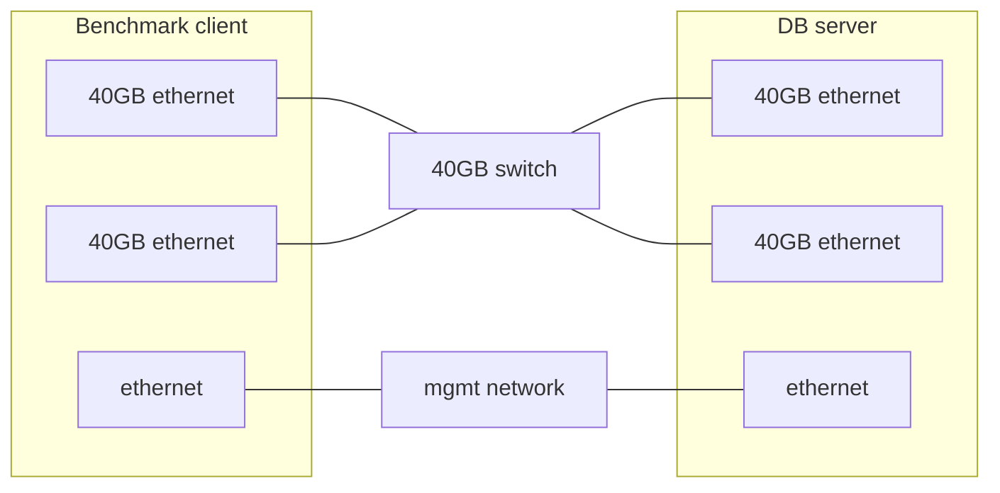

# Redis on KVM workload

In this readme, you will find out how to run a memtier benchmark on a cluster of KVM-hosted Redis servers. 

## The test environment details

* Dedicated LAN or back-to-back (b2b) connection is used for benchmark traffic
* MacVTap interface is used to avoid the performance penalty of linux bridge 
* Client and server machines are coupled using their NUMA-respective NICs (memtier_benchmark in a docker container resides in the client machine whereas VMs with Redis database instance reside in the server machine) 
* VM's are created from pre-existing qcow2 images and use cloud-init configdrives for a basic set-up
* Most of the software runs in docker containers, the OS is Linux
* Consul is a DNS-based service discovery. (www.consul.io)
  * If you want to check if the Redis service is up and running, you can use Consul that runs on each virtual machine. Consul originates from the server machine and runs as an agent on each VM.
  *  We use Consul to discover IPs’ of Redis services in the stages of populating Redis databases and running the benchmark. 
* You can optionally export benchmark results to an S3 bucket

## Prework

You will need two machines: a client and a server. Once you physically set up your machines, you will have to configure them in order to run the memtier benchmark. 

Before you start working with the repository, make sure you have installed: 

* `Docker` on your client and server machines 
* `Ansible 2.7` 
* A python module – `netaddr` on your client machine. You can install it with your package manager or using pip. 

